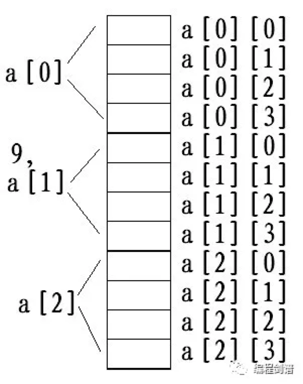

- [一、理解数组](#一理解数组)
  - [1.1 为什么要有数组？](#11-为什么要有数组)
  - [1.2 数组定义](#12-数组定义)
  - [1.3 数组元素的使用](#13-数组元素的使用)
- [二、内存分布](#二内存分布)
- [三、常见操作](#三常见操作)
  - [3.1 数组元素的遍历](#31-数组元素的遍历)
  - [3.2 数组赋初值](#32-数组赋初值)
- [四、二维数组](#四二维数组)
  - [4.1 本质](#41-本质)
  - [4.2 内存映像图](#42-内存映像图)
  - [4.3 二维数组赋初值](#43-二维数组赋初值)
  - [4.4 二维数组的遍历](#44-二维数组的遍历)
- [五、字符数组与字符串](#五字符数组与字符串)
  - [5.1 字符串](#51-字符串)
  - [5.2 运算符：sizeof()](#52-运算符sizeof)
    - [5.2.1 sizeof()的用法](#521-sizeof的用法)
      - [5.2.1.1 sizeof(数据类型名称)](#5211-sizeof数据类型名称)
      - [5.2.1.2 sizeof(变量名称或数组名称)](#5212-sizeof变量名称或数组名称)
      - [5.2.1.3 sizeof(字符串常量)](#5213-sizeof字符串常量)
  - [5.3 strlen()函数](#53-strlen函数)
  - [5.4 总结](#54-总结)
- [六、说明](#六说明)

三步走战略的打法，五大能力培养体系的构建。

数组、指针、函数，并列 C 语言三大重点，尤其 C 指针，堪称 C 之灵魂，从 C 数组开始，勤思苦练，必须多敲、搞清楚底层原理，系统设计，从宏观、哲学上理解 C 之精髓。

**强烈建议：b 站郝斌 C 视频结合着看。**

## 一、理解数组

### 1.1 为什么要有数组？

数组：多个内存变量元素，共同使用一个变量名称，并用下标加以区分。

数组与变量一样，必需先定义，再使用。

```c
int a[10]; //定义了一个名称为 a 的，拥有 10 个 int 类型元素的数组；
```

**定义数组时，[] 里的内容不能是浮点数据，也不能是变量或者含有变量的表达式。**

```c
int a[1+2*2], b['a']; //这种定义是正确的；
```

### 1.2 数组定义

int ar[10];

**这只能表示存在一个拥有 10 个 int 类型的元素的数组 ar，在这条定义语句之外的其他地方，ar 不表示数组的任何一个元素，也不表示数组的所有元素，它仅仅是数组名称而已。**

### 1.3 数组元素的使用

数组元素的定义、与使用，是完全不一样的。

```c
设有如下数组：int a[10];

a 数组的 10 个元素分别是：a[0]，a[1],  a[2]......a[9]
```

数组元素下标范围取值范围在[0, n)之间，其中 n 为数组元素个数，这个数组将在内存中占用 40B 的连续存储空间。

## 二、内存分布

**数组在内存中的存储方式**

<div align=center></div>
<p align=center>(一维数组存储方式)</p>

```c
int array[5];

array 数组应该有 5 个元素：array[0]、array[1]、array[2]、array[3]、array[4];

此时，我们的考虑，array[0]、array[4] 的前面 array[-1]、后面 array[5] 是否还有内存空间，还能访问到吗？
```

**逻辑上不存在，物理上存在！！！**

**数组的定义仅仅约束的是人的思想，根本无法约束计算机的行为，关于数组下标越界，只是一个传说！**

**C 语言编译软件是不能发现“下标越界”的错误的！这意味着：“下标越界”这种错误完全需要靠程序员非常高的编程素养来避免！**

## 三、常见操作

### 3.1 数组元素的遍历

对于数组中的元素，进行不重复、无遗漏的一次性访问。

下面几种错误的输出方式：

int a[10]; 元素有：a[0]......a[9]，打算输出 a 数组中的所有值。

```c
printf("%d\n", int a[10]);  //错误
printf("%d\n", a[10]);  //这条语句被 C 语言认为，输出的是数组 a 的，下标为 10 的，第 11 个元素的值
```

对于已经定义了一个拥有 n 个元素的数组 ar；对于这个数组所有元素进行遍历的程序框架是：

```c
for(i = 0; i < n; i++)
{
    ...ar[i]...
}
```

- 总是从下标为 0 的元素开始遍历；
- 下标总是连续变化，这意味着，对数据的遍历是连续的，不跳跃，不重复；

数据存储在数组中需要满足的 3 个条件：

1. 从下标为 0 的第一个元素（首元素）开始存放；
2. 连续存放；
3. 上述两个特点必须保持动态满足（意思是：无论删除还是插入数据，在删除或插入数据后，依然要满足上述两个基本条件）；

**对于数组的编程，主要考虑的是下标，或者可以说：玩数组就是玩下标。**

### 3.2 数组赋初值

数组赋初值操作仅能发生在数组定义语句未结束时。

```c
int a[5] = {1, 2, 3, 4, 5};
int a[5] = {1, 2, 3, 4, 5, 6}; //语法错误
int a[5] = {1, 2, 3}; //不完全赋初值：初值个数少于所申请的数组元素个数，则从下标为 0 的元素开始，前面连续若干个元素被赋初值，其余元素的值被 C 语言统一赋值为 0(不是垃圾数据)
int a[100] = {1};
int a[5] = {}; //语法错误
int a[]; //语法错误，不能形成有效的数据类型（长度不定）
int a[] = {1, 2, 3, 4, 5, 6, 7}; //定义数组，不明确声明数组元素个数，但赋初值；则，数组元素个数取决于初值个数
```

## 四、二维数组

### 4.1 本质

```c
int a[3][4]; //3行4列；
```

**计算机内存根本就没有二维及多维数组，因为内存是一维，线性管理的。**

### 4.2 内存映像图

<div align=center></div>
<p align=right><font size=2>内存布局</font></p>

### 4.3 二维数组赋初值

```c
int a[3][4] = {
    {1, 2, 3, 4},
    {5, 6, 7, 8},
    {9, 10, 11, 12},
};  //二维数组是集合的集合；

int a[3][4] = {1, 2, 3, 4, 5, 6, 7, 8, 9, 10, 11, 12}; //二维数组的本质还是一维的了；
```

```c
int a[3][4] = {{1}, {2}, {3}, {4}}; //语法错误，初始化数据个数过多；
int a[3][4] = {{}, {1}}; //语法错误；

int a[][4] = {...};
int a[][4][5] = {...};  //这种缺省的数组初始化是正确的；
```

### 4.4 二维数组的遍历

```c
for(i = 0; i < row; i++){
    for(j = 0; j < col; j++){
            ...a[i][j]...
    }
}
```

## 五、字符数组与字符串

### 5.1 字符串

以 0 结束的字符数组,**这里的 0，就是数字 0，不是字符零 '0'，其ASCII 码值为 48。**

```c
"abcdef"
012345
printf("%c\n", "abcdef"[3]);
```

```c
char s[5] = {'A', 'B', 'C', 'D', 'E'}; //字符数组
char s[5] = {'A', 'B', 'C', 'D', '0'}; //字符数组
char s[5] = {'A', 'B', 'C', 'D', 0}; //字符串
char s[5] = "ABCD"; //字符串
char s[5] = {'A', 'B', 'C', 'D'}; //字符串
```

**字符串常量（""，所括起来的内容）的最后，一定存在着一个看不见的 0 结束标志！**

```c
char s[6] = "abcdef";  //语法错误，最后有一个 0 结束标志；
```

### 5.2 运算符：sizeof()

它是一个运算符，而非函数！！！，是一个单目运算符，其运算优先级在单目运算符中最低。

#### 5.2.1 sizeof()的用法

##### 5.2.1.1 sizeof(数据类型名称)

sizeof(int)、sizeof(float)、sizeof(char)，其计算结果：**相关数据类型所占用的内存空间的字节数。**

##### 5.2.1.2 sizeof(变量名称或数组名称)

```c
char a;
double b;
short c[100];

sizeof(a) ==> 1B
sizeof(b) ==> 8B
sizeof(c) ==> 200B
```

##### 5.2.1.3 sizeof(字符串常量)

```c
sizeof("abcde") ==> 6B;
```

其运算结果：**该字符串常量在内存中所占用的字节数（该数值是字符串长度+1，这个 1B 就是 0 结束标志！）**

### 5.3 strlen()函数

**是用来计算字符串长度。**

若要调用 strlen() 函数，则必须在程序的最开始加上：#include<string.h>。

```c
printf("%d\n", strlen("abcdefg"));  //结果为7
```

对于字符串的处理：**遇 0 则止（调用字符串函数）**

### 5.4 总结

- sizeof() 是计算所占用的空间字节大小；
- strlen() 是计算字符串数组的长度，遇 0 则止；

本篇文章仅仅是数组入门，对于数组的本质掌握是非常的关键，尤其在跟指针的结合，理解，打好基础，进阶提升。

## 六、说明

原创文章链接：[C 语言程序设计-->数组](https://mp.weixin.qq.com/s?__biz=MzU4MjQ3NzEyNA==&mid=2247483942&idx=1&sn=2746282247afd15cfcd3d5d27cf198e1&chksm=fdb6f60dcac17f1bda35132ff44bc260b0a6aef3bff509bb94edaa8ca987c6be12013fa5ee83&token=1250675081&lang=zh_CN#rd)
