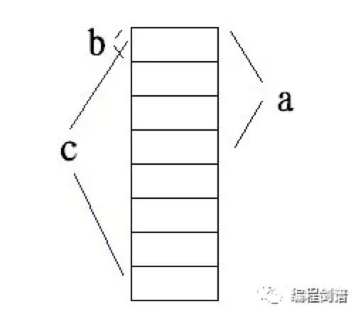

- [结构体与共用体](#结构体与共用体)
  - [1、结构体](#1结构体)
  - [2、共用体](#2共用体)
- [宏定义与用户自定义类型](#宏定义与用户自定义类型)
  - [1、宏定义](#1宏定义)
  - [2、用户自定义类型](#2用户自定义类型)
- [动态存储分配](#动态存储分配)
  - [1、静态存储分配](#1静态存储分配)
  - [2、动态存储分配](#2动态存储分配)
  - [3、举 2 个例子](#3举-2-个例子)
    - [案例 1](#案例-1)
    - [案例 2](#案例-2)
- [说明](#说明)

本篇文章是 C 语言入门级别的最后一篇文章，到此为止，写了整整十篇 C 语言入门文章，都是把自己所学分享出来，之后会写 C 语言进阶之旅，在基础上进行拔高。

## 结构体与共用体

### 1、结构体

```c
学生成绩，对于每一个学生，需要考察的一些信息，这就是现实问题
char Id[9];    //学号
char Name[15]; //姓名
int Age;      //年龄
double Score; //成绩
```

要管理学生，每个学生要考虑的维度比较多，没有哪一种数据类型可以很好的刻画这种关系，此时就需要多个类型来共同定义，形成新的数据类型，也就是结构体！

```c
struct STUDENT_INFO { //结构体定义
    char Id[9];    
    char Name[15]; 
    int Age;      
    double Score; 
};

struct STUDENT_INFO a; //这个 a 就是结构体数据类型的一个实例，里面是包含那么几个变量的。
//结构体的长度是所有成员的长度之和
```

**结构体是 C 语言具有“自我扩充能力”的重要机制。**

C 语言的基本数据类型有七大类型，这些类型都是由 C 系统提前确定的；而结构体类型是由用户根据自身需要而定义的，是 C 系统本身不具备的，这是 C 语言革命性的一步。

**结构体是对 C 语言数据类型的强力扩充！**

注意：结构体的定义本身仅仅是“设计、蓝图”，并不占内存空间，当将其实例化后，这个实例才真正的占用存储空间。

- . 运算符，结构体实例取其成员的运算符；
- -> 运算符，指向结构体实例的指针取其成员的运算符；

定义结构体时，赋初值的初值顺序，必须保证与结构体中成员数据类型是一致的；**两个完全一模一样的结构体实例，之间是可以进行赋值操作的。**

### 2、共用体

```c
union TEST {
    int a;
    char b;
    double c;
}

union TEST a, *p = &a;
a.a  <==>  p->a
a.b  <==>  p->b
a.c  <==>  p->c
//两边表达的是一个意思，就是取共用体成员的值
```

共用体的诸成员共同使用同一起始地址空间。

共用体内存映像图：

<div align=center></div>
<p align=right><font size=2>共用体内存映像图</font></p>

**共用体空间大小取决于共用体中，长度最长的成员的长度。**

```c
sizeof(union TEST)  -> 8B
```

## 宏定义与用户自定义类型

### 1、宏定义

#define 标识符，被替换的信息（**这里不能随便出现分号**）

```c
#define  PI  3.1415926
...
    a = PI * r * r; <=> a = 3.1415926 * r * r;

#define NUM 3+4
...
    a = NUM * 3 / NUM; <=> a = 3+4 * 3 / 3+4

//深入理解：只替换，不计算
```

宏替换不能改变运算量，就是简简单单的完全替换就好。

宏替换被广泛使用的关键在于以下两点：

1. **提高程序的可维护性**：就是针对同一个数字，可能在代码中多次出现，为了方便修改，上面用个宏替换，可以达到只修改一处，其他的地方都被修改的好处。
2. **提高程序的可读性**：用宏替换，便于理解每一个数字所代表的人文化含义，可以知道代表的是什么意思。

**神仙数字**：是指在程序中出现的常量数值，尤其是整型常量数值，一看根本不知道是啥意思，没有任何代表含义的数字。

### 2、用户自定义类型

typedef 是关键字；

格式：typedef  已有类型  新类型;

```c
typedef int a, b, c;
//上述语句将产生 3 个新的数据类型，分别为：a, b, c
int n;  <=>  a n;  //此时 a 就代表 int 数据类型

#define DI int *
typedef int * TI; //这条语句所产生的新类型是 TI，其对应的数据类型是 int *
```

其实用define、typedef 声明新的数据类型，两者在碰到指针、数组、以及结构体时，所体现的情况均不一样，一定要小心分析这些情况，尽量用 typedef 声明你想要的新数据类型，具体的在 C 语言进阶中写。

## 动态存储分配

### 1、静态存储分配

以前所定义的变量，数组统统属于静态存储分配方式。

```c
int a, b[50];
```

在源程序级别，用静态存储分配定义的变量和数组，其空间大小一经定义，终生不变！所以说是“静态”的，这使得程序的适应性受到了极大的限制。

我此时希望代码在运行的过程中，根据我们临时需要，“动态”地申请存储空间。

### 2、动态存储分配

动态存储分配是通过两个函数完成的：malloc() 和 free()，前者用来申请空间，后者用来释放空间。

```c
#include <malloc.h>

int *p;
p = (int *)malloc(1000); //申请了 1000B 空间，也就是 250 个 int 元素的数组
//到了这里，C 语言的数组彻底失去它存在的意义！
free(首地址);  //释放以 p 的值为首地址的空间。
```

### 3、举 2 个例子

#### 案例 1

```c
#include <malloc.h>
  
int *p; i;
for (i = 0; i < 3; i++) {
    p = (int *)malloc(sizeof(int) * 30);
}
...

for (i = 0; i < 3; i++) {
    free(p);  //释放以 p 的值为首地址的空间
}
```

**分析：**

- **多次申请空间，将所得到的空间的首地址赋值给 p 变量；由于赋值的特点是覆盖，因此，最终 p 变量中仅保持了最后一次申请得到的空间的首地址，以前所申请空间的首地址被覆盖了（遗失了）；使得那些空间不但不能再使用，甚至还不能释放！这称为“内存泄露”！**
- **free(p) 进行了多次对同一首地址空间的释放操作，这是致命的运行时错误！**

#### 案例 2

```c
#include <malloc.h>
#include <stdio.h>
 
int *fun() {
    int a[20];  //动态存储分配将不会出现以下的问题

    return a;
}

int main (void) {
    int *p1;

    p1 = fun();
    free(p1);
}
```

**分析：**

1. **在 fun() 函数中定义的数组 a，是 fun() 函数的“私有”数组，只有 fun() 函数对其能进行操作；而且数组 a 随着 fun() 函数运行结束，而被 C 自动地释放空间。**
2. **fun() 函数将一个已经释放了空间的首地址，以函数返回值方式回传给主函数中的指针变量 p1，使得 p1 指向了一个已经释放了（不能对其进行任何操作）的空间；如果出现了 \*p1 或者 p1[1]、p1[2] 这样的操作，将会出现“内存非法访问”的错误。**
3. **程序执行到 free(p1); 将彻底失败，因为，OS 根本无法找到以 p1 的值为首地址的空间进行释放操作！**

对于以上的 2 个例子，多琢磨，自己多想一下，理解清楚了，也就没那么难了，对于问题，不要总觉得简单，沉下心来好好学习才是王道！

C 语言程序设计-->入门篇，我算是写完了，一共写了 10 篇文章，希望各位有时间了，好好看看，仔细研究；我写的比较基础，比较简单，也好理解，不管我写的怎么样，我愿意把这些基础分享出来，希望在你学 C 的路上能帮到你！

你能把我写的 C 全部吃透的话，这才算是入门 C 语言了，系统性的掌握了 C 的核心知识点。

C 入门写完了，C 进阶要来了，这才仅仅是开始。。。

## 说明

原创文章链接：[C 语言程序设计-->结构体、共用体、动态存储分配、define、typedef](https://mp.weixin.qq.com/s?__biz=MzU4MjQ3NzEyNA==&mid=2247484025&idx=1&sn=86f360772938392d35d33f1ef765f6b1&chksm=fdb6f652cac17f44a9a40cb3020275177e941ce8230e9c117b8b7399f4a0913207f59e8d45f6&token=1250675081&lang=zh_CN#rd)
