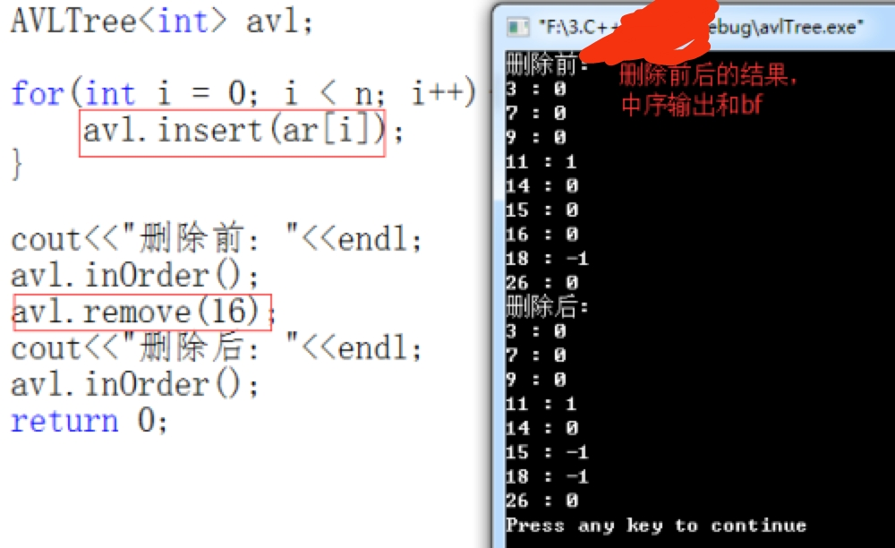

- [一、AVL树删除](#一avl树删除)
- [二、AVL树删除代码](#二avl树删除代码)
- [三、完整代码+测试代码+运行结果](#三完整代码测试代码运行结果)
  - [3.1 完整代码](#31-完整代码)
  - [3.2 测试代码](#32-测试代码)
  - [3.3 运行结果](#33-运行结果)
- [四、说明](#四说明)

## 一、AVL树删除

思路：

1. 首先找到要删除的结点；没找到，直接false返回退出即可；
2. 将其转化为只有一个分支的结点，前面的路径都要入栈；
3. 其父节点(parent)的平衡因子(根据父的左/右=p(要删除的结点)，修改父的bf)，有几种情况：
   1. 父节点的bf=1/-1，代表原先有两个结点，现在剩下一个了，直接退出循环，不用再往上寻找更改bf了；
   2. 父节点的bf=0；
   3. 代表此时的往上更改爷爷结点(在此出栈即可，栈中保存了路径信息)的bf，看情况(bf=2/-2)是否进行旋转，和要进行相应的旋转方式；
4. 判断栈空，进行相应的连接操作；
5. 最后删除这个结点。

相应部分情况：

<div align=center></div>
<p align=center>(情况1)</p>

<div align=center></div>
<p align=center>(情况2)</p>

## 二、AVL树删除代码

```cpp
template<typename Type>
bool AVLTree<Type>::remove(AVLNode<Type> *&t, const Type &x){
    AVLNode<Type> *p = t;
    AVLNode<Type> *parent = NULL;  //父结点
    AVLNode<Type> *q = NULL;  //删除结点的辅助结点
    stack<AVLNode<Type> *> st;

    AVLNode<Type> *ppr; //爷爷结点

    int flag = 0;
    while(p != NULL){
        if(p->data == x){
            break;
        }
        parent = p;
        st.push(parent);
        if(x < p->data){
            p = p->leftChild;
        }else{
            p = p->rightChild;
        }
    } //以上是：查找删除点
    if(p == NULL){  //没有要删除的结点
        return false;
    }
    if(p->leftChild!= NULL && p->rightChild!=NULL){
        parent = p;
        st.push(parent);

        q = p->leftChild;
        while(q->rightChild != NULL){
            parent = q;
            st.push(parent);
            q = q->rightChild;
        }

        p->data = q->data;
        p = q;
    }
    
    if(p->leftChild != NULL){
        q = p->leftChild;
    }else{
        q = p->rightChild;
    }
//以上是：使其要删除的转化为只有一个分支的
    if(parent == NULL){  //删除的是根结点，并且无入栈，代表只有一个分支，并没有寻找
        t = q;  
    }else{
        if(parent->leftChild == p){
            flag = 0;
            parent->leftChild = q;
        }else{
            flag = 1;
            parent->rightChild = q;
        }

        while(!st.empty()){
            parent = st.top();
            st.pop();
            if(parent->leftChild==q){ //对要删除的父节点更改bf;
                parent->bf++;
            }else{
                parent->bf--;
            }
            if(!st.empty()){
                ppr = st.top();
                if(ppr->leftChild == parent){
                    flag = 0;
                }else{
                    flag = 1;
                }
            }
            if(parent->bf==-1 || parent->bf==1 ){
                break; //删除前的平衡因子为0，此时不用再调整其它平衡因子,直接退出循环;
            }

            if(parent->bf == 0){  //原先只有左孩子/右孩子
                q = parent; //往上回溯更改爷爷结点的bf；
            }else{  //此时到达2,已经不平衡了，的进行旋转化的调整
                if(parent->bf < 0){
                    flag = -1;
                    q = parent->leftChild;
                }else{
                    flag = 1;
                    q = parent->rightChild;
                }
                if(q->bf == 0){
                    if(flag == -1){
                        
                    }
                }
                if(parent->bf > 0){
                    q = parent->rightChild;
                    if(q->bf == 0){
                        RotateL(parent);
                    }else if(q->bf > 0){
                        RotateL(parent);
                    }else{
                        RotateRL(parent);
                    }
                }else{
                    q = parent->leftChild;
                    if(q->bf == 0){
                        RotateR(parent);
                    }else if(q->bf < 0){
                        RotateR(parent);
                    }else{
                        RotateLR(parent);
                    }
                }
            }
        }
        if(st.empty()){
            t = parent;  //直接更改root
        }else{
            AVLNode<Type> *tmp = st.top();  //当前的栈顶结点使其的左/右指向parent(是旋转化后的根);
            if(parent->data < tmp->data){  
                tmp->leftChild = parent;
            }else{
                tmp->rightChild = parent;
            }
        }

    }

    delete p;  //删除结点;
    return true;
}
```

## 三、完整代码+测试代码+运行结果

### 3.1 完整代码

```cpp
#ifndef _AVL_TREE_H_
#define _AVL_TREE_H_

#include<iostream>  //引入头文件
#include<stack>    //要用栈保存路径信息
using namespace std;

template<typename Type>
class AVLTree;

template<typename Type>
class AVLNode{   //AVL树的结点
    friend class AVLTree<Type>;
public:
    AVLNode() : data(Type()), leftChild(NULL), rightChild(NULL), bf(0){}
    AVLNode(Type d, AVLNode *left = NULL, AVLNode *right = NULL) 
        : data(d), leftChild(left), rightChild(right), bf(0){}
    ~AVLNode(){}
private:
    Type data;
    AVLNode *leftChild;
    AVLNode *rightChild;
    int bf;  //多了一个平衡因子
};

template<typename Type>
class AVLTree{   //AVL树的类型
public:
    AVLTree() : root(NULL){}
public:
    bool insert(const Type &x){
        return insert(root, x);
    }
    bool remove(const Type &x){
        return remove(root, x);
    }
    void inOrder()const{
        inOrder(root);
    }
protected:
    void inOrder(AVLNode<Type> *t)const{
        if(t != NULL){
            inOrder(t->leftChild);
            cout<<t->data<<" : "<<t->bf<<endl;;
            inOrder(t->rightChild);
        }
    }
    bool insert(AVLNode<Type> *&t, const Type &x); //插入函数
    bool remove(AVLNode<Type> *&t, const Type &x);
    void RotateR(AVLNode<Type> *&ptr){  //右旋
        AVLNode<Type> *subR = ptr;
        ptr = ptr->leftChild;
        subR->leftChild = ptr->rightChild;
        ptr->rightChild = subR;
        ptr->bf = subR->bf = 0;
    }
    void RotateL(AVLNode<Type> *&ptr){  //左旋
        AVLNode<Type> *subL = ptr;
        ptr = subL->rightChild;
        subL->rightChild = ptr->leftChild;
        ptr->leftChild = subL;
        subL->bf = ptr->bf = 0;
    }
    void RotateLR(AVLNode<Type> *&ptr){  //先左后右旋转
        AVLNode<Type> *subR = ptr;
        AVLNode<Type> *subL = ptr->leftChild;
        ptr = subL->rightChild;

        subL->rightChild = ptr->leftChild;
        ptr->leftChild = subL;
        if(ptr->bf <= 0){
            subL->bf = 0;
        }else{
            subL->bf = -1;
        }

        subR->leftChild = ptr->rightChild;
        ptr->rightChild = subR;
        if(ptr->bf == -1){
            subR->bf = 1;
        }else{
            subR->bf = 0;
        }

        ptr->bf = 0;
    }
    void RotateRL(AVLNode<Type> *&ptr){  //先右后左旋转
        AVLNode<Type> *subL = ptr;
        AVLNode<Type> *subR = ptr->rightChild;
        ptr = subR->leftChild;

        subR->leftChild = ptr->rightChild;
        ptr->rightChild = subR;
        if(ptr->bf >=0){
            subR->bf = 0;
        }else{
            subR->bf = 1;
        }

        subL->rightChild = ptr->leftChild;
        ptr->leftChild = subL;
        if(ptr->bf == 1){
            subL->bf = -1;
        }else{
            subL->bf = 0;
        }
        ptr->bf = 0;
    }
private:
    AVLNode<Type> *root;
};

template<typename Type>
bool AVLTree<Type>::insert(AVLNode<Type> *&t, const Type &x){
    AVLNode<Type> *p = t;
    AVLNode<Type> *parent = NULL; // 记录前驱结点，方便连接和调整平衡因子
    stack<AVLNode<Type> *> st; //用栈记录插入的路径，方便调整栈中结点的平衡因子;
    int sign;

    while(p != NULL){
        if(x == p->data){ //要插入的数据和AVL树中的数字相同,则返回失败！
            return false;
        }

        parent = p;
        st.push(parent); //找过的入栈
        if(x < p->data){
            p = p->leftChild;
        }else if(x > p->data){
            p = p->rightChild;
        }
    } // 找插入位置,不用递归，就是为了记录路径信息
    
    p = new AVLNode<Type>(x);
    if(parent == NULL){
        t = p;    //判断是不是第一个结点，进行root的连接;
        return true;
    }

    if(x < parent->data){ //此时通过父节点的数据判断插入的是左还是右
        parent->leftChild = p;
    }else{
        parent->rightChild = p;
    }
    //新插入点的bf为0,关键是栈中的平衡因子的调整
/////////////////////////////////////////////////////// 以上完成插入工作
    while(!st.empty()){  //栈不空，出栈顶元素
        parent = st.top();
        st.pop();

        if(p == parent->leftChild){   //判断插入的是父节点的左/右孩子,
            parent->bf--;           //让其bf++/--;
        }else{
            parent->bf++;
        }

        //以下判断栈中的平衡因子，看是否需要进行旋转调整
        if(parent->bf == 0){  //bf=0，直接跳出循环
            break;
        }
        if(parent->bf==1 || parent->bf==-1){ 
            p = parent;  //此时在向上走，判断bf;
        }else{  //以下的bf为2/-2;利用标志判断左右旋;
            sign = parent->bf > 0 ? 1 : -1;
            if(p->bf == sign){  //符号相同为单旋
                if(sign == 1){  //为1左旋
                    RotateL(parent);  
                }else{
                    RotateR(parent); //右旋
                }
            }else{  //符号不同，为双旋
                if(sign == 1){  
                    RotateRL(parent); //为1右左
                }else{
                    RotateLR(parent);
                }
            }
/*
    以下方法也可以判断左右旋
        else
        {
            if(parent->bf < 0)  //左边
            {
                if(p->bf<0 && p==parent->leftChild)    //    / 只能是左孩子
                {
                    //RotateR(parent);
                }
                else if(p->bf>0 && p == parent->leftChild)  //   <
                {
                    //RotateLR(parent);
                }
            }
            else
            {
                if(p->bf>0 && p==parent->rightChild)   //   \ 
                {
                    //RotateL(parent);
                }
                else if(p->pf<0 && p==parent->rightChild)  //      >
                {
                    //RotateRL(parent);
                }
            }
        }

*/
    break;
        }
    }

    if(st.empty()){  //通过旋转函数，此时parent指向根节点;
        t = parent;  //此时调到栈底了，旋转后将更改root的指向
    }else{
        AVLNode<Type> *tmp = st.top();  //当前的栈顶结点
        if(parent->data < tmp->data){  
            tmp->leftChild = parent;
        }else{
            tmp->rightChild = parent;
        }
    }

    return true;
}

template<typename Type>
bool AVLTree<Type>::remove(AVLNode<Type> *&t, const Type &x){
    AVLNode<Type> *p = t;
    AVLNode<Type> *parent = NULL;  //父结点
    AVLNode<Type> *q = NULL;  //删除结点的辅助结点
    stack<AVLNode<Type> *> st;

    AVLNode<Type> *ppr; //爷爷结点

    int flag = 0;
    while(p != NULL){
        if(p->data == x){
            break;
        }
        parent = p;
        st.push(parent);
        if(x < p->data){
            p = p->leftChild;
        }else{
            p = p->rightChild;
        }
    } //以上是：查找删除点
    if(p == NULL){  //没有要删除的结点
        return false;
    }
    if(p->leftChild!= NULL && p->rightChild!=NULL){
        parent = p;
        st.push(parent);

        q = p->leftChild;
        while(q->rightChild != NULL){
            parent = q;
            st.push(parent);
            q = q->rightChild;
        }

        p->data = q->data;
        p = q;
    }
    
    if(p->leftChild != NULL){
        q = p->leftChild;
    }else{
        q = p->rightChild;
    }
//以上是：使其要删除的转化为只有一个分支的
    if(parent == NULL){  //删除的是根结点，并且无入栈，代表只有一个分支，并没有寻找
        t = q;  
    }else{
        if(parent->leftChild == p){
            flag = 0;
            parent->leftChild = q;
        }else{
            flag = 1;
            parent->rightChild = q;
        }

        while(!st.empty()){
            parent = st.top();
            st.pop();
            if(parent->leftChild==q){ //对要删除的父节点更改bf;
                parent->bf++;
            }else{
                parent->bf--;
            }
            if(!st.empty()){
                ppr = st.top();
                if(ppr->leftChild == parent){
                    flag = 0;
                }else{
                    flag = 1;
                }
            }
            if(parent->bf==-1 || parent->bf==1 ){
                break; //删除前的平衡因子为0，此时不用再调整其它平衡因子
            }

            if(parent->bf == 0){  //原先只有左孩子/右孩子
                q = parent; //往上回溯更改爷爷结点的bf；
            }else{  //此时到达2,已经不平衡了，的进行旋转化的调整
                if(parent->bf < 0){
                    flag = -1;
                    q = parent->leftChild;
                }else{
                    flag = 1;
                    q = parent->rightChild;
                }
                if(q->bf == 0){
                    if(flag == -1){
                        
                    }
                }
                if(parent->bf > 0){
                    q = parent->rightChild;
                    if(q->bf == 0){
                        RotateL(parent);
                    }else if(q->bf > 0){
                        RotateL(parent);
                    }else{
                        RotateRL(parent);
                    }
                }else{
                    q = parent->leftChild;
                    if(q->bf == 0){
                        RotateR(parent);
                    }else if(q->bf < 0){
                        RotateR(parent);
                    }else{
                        RotateLR(parent);
                    }
                }
            }
        }
        if(st.empty()){
            t = parent;  //直接更改root
        }else{
            AVLNode<Type> *tmp = st.top();  //当前的栈顶结点使其的左/右指向parent(是旋转化后的根);
            if(parent->data < tmp->data){  
                tmp->leftChild = parent;
            }else{
                tmp->rightChild = parent;
            }
        }

    }

    delete p;  //删除结点;
    return true;
}
#endif
```

### 3.2 测试代码

```cpp
#include"avlTree.h"

int main(void){
    int ar[] = {16, 3, 7, 11, 9, 26, 18, 14, 15,};
    int n = sizeof(ar) / sizeof(int);
    AVLTree<int> avl;

    for(int i = 0; i < n; i++){
        avl.insert(ar[i]);
    }

    cout<<"删除前: "<<endl;
    avl.inOrder();
    avl.remove(16);
    cout<<"删除后: "<<endl;
    avl.inOrder();
    return 0;
}
```

### 3.3 运行结果

<div align=center></div>

<div align=center></div>

## 四、说明

原创文章链接：[从零开始学习数据结构-->AVL树之删除算法](https://mp.weixin.qq.com/s?__biz=MzU4MjQ3NzEyNA==&mid=2247485492&idx=1&sn=33cbd977c0561954cef05cc5cfec94eb&chksm=fdb6fc1fcac175099cb77513edde1c6276e455e50dc85de5694fdb2360e40738f27c8a78a373&token=1129091266&lang=zh_CN#rd)
