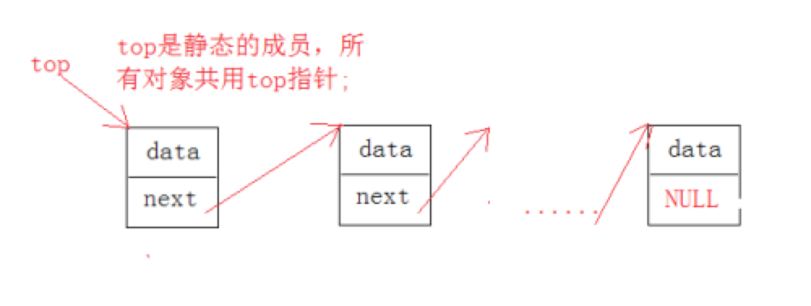
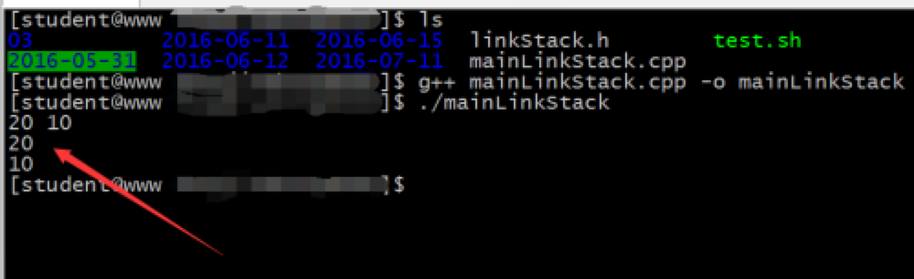

- [前言](#前言)
- [一、栈](#一栈)
- [二、数组存储](#二数组存储)
  - [2.1 代码如下](#21-代码如下)
  - [2.2 测试代码](#22-测试代码)
  - [2.3 运行结果](#23-运行结果)
- [三、链式存储](#三链式存储)
  - [3.1 代码如下](#31-代码如下)
  - [3.2 测试代码](#32-测试代码)
  - [3.3 运行结果](#33-运行结果)
- [四、栈和堆](#四栈和堆)
- [五、系统堆栈](#五系统堆栈)
- [六、一个误区](#六一个误区)
- [七、说明](#七说明)

## 前言

栈是一种非常重要的数据结构，核心场景：函数调用、递归变为非递归算法等。

**我写数据结构的核心：对于课本上已有定义、代码片段、我不会简单摘抄课本内容，把课本上面的总结归纳分享，那样的话，感觉没啥实际的必要，还不如直接看书呢。**

**主要在于自己对该数据结构的理解，以及给出完整代码，体现出通用性 + 工具性，一定要好好体会其中我写的文字，对于程序员来说，好的代码往往是最好的注释了，多看看别人写的优秀代码，有助于提升自己的编程能力。**

**我以前学习的时候，最烦的就是给出代码片段（课本就这样），完全没有上下文，对于新手的理解难度陡增，看到这个参数，就会想咋突然冒出这个，返回得到这个有啥用呢？产生一系列的疑惑，学的不明不白。**

**有了上下文代码、以及我给出了测试代码，就能很好的从头到尾的跟一遍，真正理解数据结构要解决的问题，这对于初学者至关重要；当你非常熟悉数据结构、以及编程能力达到一个层次的时候，那会看到代码片段就能推理出来上下文，说明你已经有了足够的编程经验了。**

推荐一本数据结构入门书籍：《大话数据结构》

## 一、栈

栈是一个线性存储结构（逻辑线性）；单端进出数据，其特点：先进后出。

栈一般都是由栈顶指针和栈底指针组成，top;

栈处理数据的特点：入栈和出栈；

**栈一般情况下是不存在遍历操作，不允许指定下标操作，只能对栈顶元素进行操作;**

栈存储结构的实现：数组方式或链表方式都可以，本文会给出具体实现代码，帮助你更好的理解、学习数据结构。

## 二、数组存储

模型如下：

<div align=center></div>

其只有这一个端口进出数据，即只能对栈顶进行操作。

### 2.1 代码如下

```cpp
#ifndef _STACK_H_
#define _STACK_H_

#include<iostream>
#include<stdlib.h>
#include<assert.h>
using namespace std;

typedef unsigned char boolean;
#define TRUE            1
#define FALSE            0
#define DEFAULT_SIZE    10

template<typename Type>
class Stack{
public:
    Stack(size_t sz);
    Stack(const Stack &t);
    Stack& operator=(const Stack &t);
    ~Stack();
public:
    bool isEmpty()const;
    bool isFull()const;
    boolean push(const Type &t);
    boolean pop(Type *t);
    boolean getTop(Type *t)const;
    void lookAllStack()const;
private:
    Type *base;
    int count;
    int top;
};

template<typename Type>
Stack<Type>::Stack(size_t sz = 0){
    count = sz > DEFAULT_SIZE ? sz : DEFAULT_SIZE;
    base = new Type[count];
    top = 0;
}
template<typename Type>
Stack<Type>::~Stack(){
    delete []base;
    count = top = 0;
}
template<typename Type>
bool Stack<Type>::isEmpty()const{
    return top<=0 ? true : false; 
}
template<typename Type>
bool Stack<Type>::isFull()const{
    return top>=count ? true : false; 
}
template<typename Type>
boolean Stack<Type>::push(const Type &t){
    assert(!isFull());
    base[top++] = t;
    return TRUE;
}
template<typename Type>
boolean Stack<Type>::pop(Type *t){
    assert(!isEmpty());
    *t = base[--top];
    return TRUE;
}
template<typename Type>
boolean Stack<Type>::getTop(Type *t)const{
    assert(!isEmpty());
    *t = base[top-1];
    return TRUE;
}
template<typename Type>
void Stack<Type>::lookAllStack()const{
    int i;
    for(i = 0; i < top; i++){
        cout<<base[i]<<"->";
    }
    cout<<"NULL"<<endl;
}
#endif

```

### 2.2 测试代码

```cpp
#include<iostream>
#include"stack.h"
using namespace std;

int main(void){
    Stack<char> s(20);
    char t;
    s.push(65);
    s.push(66);
    s.push(67);
    s.pop(&t);
    cout<<t<<endl;
    s.lookAllStack();

    return 0;
}
```

### 2.3 运行结果

<div align=center></div>

## 三、链式存储

头插法实现先进后出的功能，top 每次都指向新插入的结点;

这次这个程序因为涉及静态模板成员的初始化问题，所以在 Linux 环境下面编译，可以通过，VC++6.0 报错;

模型如下：

<div align=center></div>

### 3.1 代码如下

```cpp
#ifndef _LINK_STACK_H_
#define _LINK_STACK_H_

#include<iostream>
#include<stdlib.h>
using namespace std;

template<typename Type>
class LinkStack{
public:
    LinkStack(){
        next = NULL;
    } 
    LinkStack(const LinkStack &s);
    LinkStack& operator=(const LinkStack &s);
    ~LinkStack(){
        
    }
public:
    bool isEmpty(){
        return top == NULL;
    }
    bool push(Type &);
    bool pop(Type *);
    bool readHead(Type *);
    void lookAllElem();
private:
    Type data;
    LinkStack *next;
    static LinkStack *top;
};

template<typename Type> //对静态成员初始化
typename LinkStack<Type>::LinkStack* LinkStack<Type>::top = NULL;

template<typename Type>
bool LinkStack<Type>::push(Type &value){
    LinkStack *tmp;

    tmp = new LinkStack;
    tmp->next = top;
    top = tmp;
    top->data = value;

    return true;
}
template<typename Type>
bool LinkStack<Type>::pop(Type *x){
    if(isEmpty()){
        return false;
    }
    *x = top->data;
    LinkStack *tmp = top;
    top = tmp->next;
    delete tmp;

    return true;
}
template<typename Type>
bool LinkStack<Type>::readHead(Type *x){
    if(isEmpty()){
        return false;
    }
    
    *x = top->data;

    return true;
}
template<typename Type>
void LinkStack<Type>::lookAllElem(){
    LinkStack *tmp;

    for(tmp = top; tmp; tmp = tmp->next){
        cout<<tmp->data<<" ";
    }
    cout<<endl;
}
#endif
```

### 3.2 测试代码

```cpp
#include"linkStack.h"

int main(void){
    LinkStack <int>s;
    int value1 = 10;
    int value2 = 20;

    s.push(value1);
    s.push(value2);
    s.lookAllElem();
    s.pop(&value1);
    cout<<value1<<endl;
    s.readHead(&value1);
    cout<<value1<<endl;

    return 0;
}
```

### 3.3 运行结果

<div align=center></div>
</br>
对模板静态成员初始化，这个知识点很重要：

```cpp
private:
    Type data;
    LinkStack *next;
    static LinkStack *top;
};
template<typename Type> //对静态成员初始化
typename LinkStack<Type>::LinkStack* LinkStack<Type>::top = NULL;
```

## 四、栈和堆

栈的最大特点是拥有记忆功能，在遍历和记录路径上面起的作用相当的大；

**栈的一个重要作用是实现函数的调用; 另一个重要作用是将递归函数变为非递归函数；**

动态存储分配 malloc、new 都是分配堆空间；堆空间必须 free、delete 手动释放，归还系统内存资源；

局部变量一般都是临时变量，所以是在栈空间上面被分配。随着函数的结束，空间被系统自动回收。

## 五、系统堆栈

系统堆栈：函数调用与栈之间的关系；由于拥有”记忆“能力，很好的实现了函数调用过程。

假设函数：f1()—>f2()—>f3()—>f4()；意思是：f1() 调用 f2()，f2() 调用 f3()，f3() 调用 f4()；那么函数调用返回顺序为：f4()—>f3()—>f2()—>f1()；

**核心六步：**

1. **函数调用时会保存主调函数现场信息；**

2. **主调函数的实参按顺序入系统堆栈，被调函数的形参变量与实参对应（值传递）；**

3. **被调函数的局部变量依然可以使用系统堆栈；**

4. **由于系统堆栈对于所有函数都是可用的，因此，任何函数的局部变量和形参变量可以被其他任何函数访问，且不会出现非法内存访问的错误；**

5. **但是由于系统堆栈在函数动态调用过程当中，其值不断发生变化，因此，既往的函数局部变量”不可靠“；动态存储分配（malloc()、new等）所申请的空间是从堆空间中取得的，与系统堆栈无关；**

6. **函数调用完毕后将恢复主调函数的现场信息，从而恢复主调函数的继续执行，这种方式很好的实现了”记忆“的功能。**

## 六、一个误区

初学数据结构：就是照着别人的代码敲，先理解吃透别人代码的思路，想清楚每一行代码的实现，当你完全理解的时候，就可以根据自己的编程思路，去独立实现该数据结构，反复几次，你就掌握了代码的实现，理解了数据结构。

**看到某段代码，就想别人为啥想的到，我咋想不到呢？千万不要有这个误区，那是因为你编程经验少所导致的，当你有了足够多的经验、以及编程功底，就可以设计方案了。**

**初学者都是模仿他人代码，吃透消化它，在转变为自己的思想，独立实现代码，经过反复的锻炼，编程能力就提升了，在工作开发中，就会形成自己的思路，去解决问题。**

**不能光看、光理解，一定一定要动手去实现它，独立实现代码逻辑，在一定程度上代表你掌握了，这就是能力的逐步提升。**

## 七、说明

原创文章链接：[从零开始学习数据结构-->栈](https://mp.weixin.qq.com/s?__biz=MzU4MjQ3NzEyNA==&mid=2247484897&idx=1&sn=7574f20382ad1c707f3d53fe9db4414b&chksm=fdb6f1cacac178dc765286a283a70e700611d426a1e7633cab1398ededb04da36bf3da5b62e6&token=1136689553&lang=zh_CN#rd)
